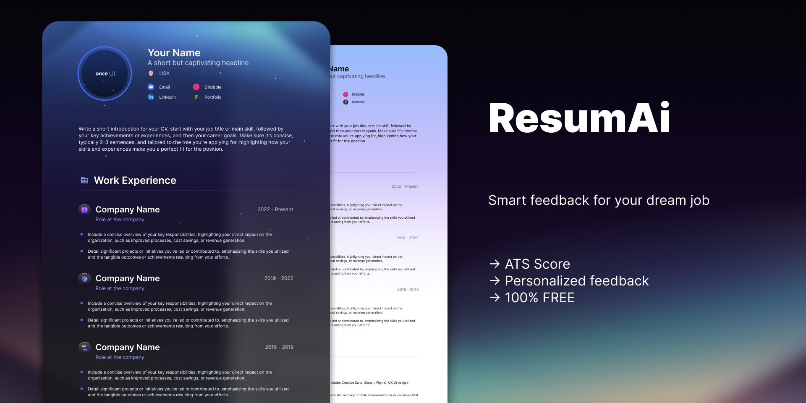

<div align="center">
  
  
  <h1>RESUMAI</h1>
  <p><strong>AI-Powered Resume Analyzer for Job Seekers</strong></p>
  
  <p>
    <a href="#features"><strong>Features</strong></a> •
    <a href="#tech-stack"><strong>Tech Stack</strong></a> •
    <a href="#quick-start"><strong>Quick Start</strong></a> •
    <a href="#demo"><strong>Demo</strong></a>
  </p>

  <p>
    
    
    
    
  </p>
</div>

---

## 📋 <a name="table">Table of Contents</a>

1. ✨ [Introduction](#introduction)
2. 🔋 [Features](#features)
3. ⚙️ [Tech Stack](#tech-stack)
4. 🤸 [Quick Start](#quick-start)
5. 🎯 [Usage](#usage)
6. 🏗️ [Project Structure](#project-structure)
7. 🚀 [Deployment](#deployment)
8. 🤝 [Contributing](#contributing)
9. 📄 [License](#license)

## <a name="introduction">✨ Introduction</a>

**RESUMAI** is a cutting-edge, AI-powered resume analysis platform that helps job seekers optimize their resumes for maximum impact. Built with modern web technologies, RESUMAI provides comprehensive feedback on resume content, structure, ATS compatibility, and overall presentation quality.

### 🎯 What RESUMAI Does

- **Smart Resume Analysis**: Upload your resume and get detailed AI-powered feedback
- **ATS Optimization**: Ensure your resume passes Applicant Tracking Systems
- **Job-Specific Scoring**: Get tailored feedback based on specific job descriptions
- **Professional Insights**: Receive actionable suggestions for content, structure, tone, and skills presentation
- **Progress Tracking**: Monitor your resume improvements over time

### 🌟 Why Choose RESUMAI?

- **No Backend Required**: Powered by Puter.js for seamless client-side functionality
- **Privacy-First**: Your data stays secure with browser-based authentication
- **Real-time Analysis**: Get instant feedback powered by Claude AI
- **Professional UI**: Clean, modern interface built with Tailwind CSS

## <a name="tech-stack">⚙️ Tech Stack</a>

### 🎨 Frontend Framework

- **[React 19.1.0](https://react.dev/)** - Latest React with modern hooks and concurrent features
- **[React Router v7](https://reactrouter.com/)** - Advanced routing with data loading, error boundaries, and SSR support
- **[TypeScript 5.8.3](https://www.typescriptlang.org/)** - Strong typing for better development experience and code quality

### 🎯 State Management & Utilities

- **[Zustand 5.0.6](https://github.com/pmndrs/zustand)** - Lightweight state management with zero boilerplate
- **[React Dropzone 14.3.8](https://github.com/react-dropzone/react-dropzone)** - Drag and drop file upload functionality

### 🎨 Styling & UI

- **[Tailwind CSS 4.1.4](https://tailwindcss.com/)** - Utility-first CSS framework for rapid UI development
- **[Clsx & Tailwind Merge](https://github.com/dcastil/tailwind-merge)** - Conditional class merging utilities
- **Custom Components** - Handcrafted UI components for optimal performance

### 🔧 Development Tools

- **[Vite 6.3.3](https://vite.dev/)** - Ultra-fast build tool with HMR and optimized production builds
- **[ESLint & Prettier](https://eslint.org/)** - Code linting and formatting for consistent code quality
- **[TypeScript Config Paths](https://github.com/dividab/tsconfig-paths)** - Path mapping for clean imports

### ☁️ Backend & Services

- **[Puter.js](https://puter.com/)** - Revolutionary browser-based backend alternative providing:
  - **Authentication**: Secure user login without traditional backend
  - **File Storage**: Cloud storage for resume files and images
  - **AI Integration**: Claude Sonnet-4 for intelligent resume analysis
  - **Key-Value Store**: Data persistence for user preferences and history

### 📄 Document Processing

- **[PDF.js 5.3.93](https://github.com/mozilla/pdf.js)** - Client-side PDF rendering and image conversion
- **Canvas API** - High-quality PDF to image conversion for previews

### 🚀 Deployment & DevOps

- **[Docker](https://www.docker.com/)** - Containerized deployment for consistent environments
- **[Vercel](https://vercel.com/)** - Optimized for React Router and static site deployment
- **Multi-stage Builds** - Optimized Docker images for production

### 🏗️ Architecture Highlights

- **Zero Backend Architecture** - Powered entirely by Puter.js cloud services
- **Client-Side First** - Maximum performance with minimal server dependencies
- **Component-Driven Development** - Reusable, maintainable component architecture
- **Type-Safe Development** - Full TypeScript coverage for robust applications

## <a name="features">🔋 Features</a>

### 🤖 AI-Powered Analysis

- **Intelligent Resume Scoring**: Get comprehensive scores across multiple dimensions
- **ATS Compatibility Check**: Ensure your resume passes through Applicant Tracking Systems
- **Job-Specific Feedback**: Tailored recommendations based on job descriptions and requirements
- **Content Quality Assessment**: Analysis of language, tone, and professional presentation

### 📊 Detailed Feedback Categories

- **Overall Score**: Comprehensive rating out of 100 points
- **ATS Score**: Specific evaluation for ATS compatibility
- **Tone & Style**: Professional language and presentation assessment
- **Content Quality**: Relevance, clarity, and impact evaluation
- **Structure & Format**: Layout, organization, and visual appeal
- **Skills Presentation**: Technical and soft skills evaluation

### 🔐 Security & Convenience

- **Browser-Based Authentication**: Secure login with Puter.js (no backend required)
- **Client-Side Storage**: Your resumes are stored securely in your personal cloud
- **Privacy-First Design**: No data leaves your control without permission
- **Cross-Device Sync**: Access your resumes from any device

### 🎨 User Experience

- **Modern, Responsive UI**: Beautiful interface that works on all devices
- **Drag & Drop Upload**: Easy resume upload with visual feedback
- **Real-time Processing**: See analysis progress with loading indicators
- **Visual Score Representation**: Intuitive gauges and charts for scores
- **Detailed Breakdown**: Expandable sections for in-depth feedback

### 💼 Professional Tools

- **Resume Gallery**: Track multiple resumes and their scores
- **Progress Monitoring**: See improvements over time
- **Export Options**: Download analysis reports
- **Multiple Format Support**: PDF resume processing with image preview

## <a name="quick-start">🤸 Quick Start</a>

### Prerequisites

Ensure you have the following installed on your machine:

- **[Git](https://git-scm.com/)** (version 2.0 or higher)
- **[Node.js](https://nodejs.org/en)** (version 18.0 or higher)
- **[npm](https://www.npmjs.com/)** (version 8.0 or higher) or **[yarn](https://yarnpkg.com/)**

### Installation

1. **Clone the repository**

   ```bash
   git clone https://github.com/BenjedouNaim/resumai.git
   cd resumai
   ```

2. **Install dependencies**

   ```bash
   npm install
   # or
   yarn install
   ```

3. **Start the development server**

   ```bash
   npm run dev
   # or
   yarn dev
   ```

4. **Open your browser**

   Navigate to [http://localhost:5173](http://localhost:5173) to see the application in action.

### Available Scripts

| Command             | Description                              |
| ------------------- | ---------------------------------------- |
| `npm run dev`       | Start development server with hot reload |
| `npm run build`     | Build the application for production     |
| `npm run start`     | Start the production server              |
| `npm run typecheck` | Run TypeScript type checking             |

### Environment Setup

The application works out of the box with Puter.js cloud services. No additional environment variables or API keys are required for local development.

## <a name="usage">🎯 Usage</a>

### Getting Started with RESUMAI

1. **Sign In**: Click the "Log In" button to authenticate with Puter.js
2. **Upload Resume**: Navigate to the upload page and drag & drop your PDF resume
3. **Add Job Details**: Enter the company name, job title, and job description
4. **Get Analysis**: Click "Analyze Resume" and wait for AI-powered feedback
5. **Review Results**: Explore detailed scores and recommendations
6. **Track Progress**: Return to the home page to see all your analyzed resumes

### Understanding Your Scores

- **90-100**: Excellent - Your resume is highly optimized
- **70-89**: Good - Minor improvements recommended
- **50-69**: Fair - Several areas need attention
- **Below 50**: Needs Work - Significant improvements required

### Best Practices

- Upload high-quality PDF resumes for best analysis results
- Provide detailed job descriptions for more accurate feedback
- Review all feedback categories for comprehensive improvements
- Re-analyze your resume after making improvements to track progress

## <a name="project-structure">🏗️ Project Structure</a>

```
resumai/
├── app/                          # Main application source
│   ├── components/              # Reusable UI components
│   │   ├── Accordion.tsx       # Collapsible content sections
│   │   ├── ATS.tsx             # ATS score display component
│   │   ├── Details.tsx         # Detailed feedback breakdown
│   │   ├── FileUploader.tsx    # Drag & drop file upload
│   │   ├── Navbar.tsx          # Navigation component
│   │   ├── ResumeCard.tsx      # Resume preview cards
│   │   ├── ScoreBadge.tsx      # Score indicator badges
│   │   ├── ScoreCircle.tsx     # Circular progress indicators
│   │   ├── ScoreGauge.tsx      # Gauge-style score display
│   │   └── Summary.tsx         # Score summary component
│   ├── lib/                    # Utility libraries
│   │   ├── pdf2img.ts          # PDF to image conversion
│   │   ├── puter.ts            # Puter.js integration & store
│   │   └── utils.ts            # Common utility functions
│   ├── routes/                 # Application routes
│   │   ├── auth.tsx            # Authentication page
│   │   ├── home.tsx            # Dashboard/home page
│   │   ├── resume.tsx          # Resume analysis view
│   │   ├── upload.tsx          # Resume upload page
│   │   └── wipe.tsx            # Data management utility
│   ├── app.css                 # Global styles and Tailwind
│   ├── root.tsx                # App root component
│   └── routes.ts               # Route configuration
├── constants/                   # Application constants
│   └── index.ts                # AI prompts and sample data
├── public/                     # Static assets
│   ├── icons/                  # SVG icons
│   ├── images/                 # Background images and assets
│   ├── Thumbnail.jpg           # Project thumbnail
│   └── pdf.worker.min.mjs      # PDF.js worker
├── types/                      # TypeScript type definitions
│   ├── index.ts                # Application types
│   └── puter.d.ts              # Puter.js type definitions
├── build/                      # Production build output
├── Dockerfile                  # Container configuration
├── package.json                # Dependencies and scripts
├── tailwind.config.js          # Tailwind CSS configuration
├── tsconfig.json               # TypeScript configuration
├── vite.config.ts              # Vite build configuration
└── README.md                   # Project documentation
```

### Key Components Overview

| Component      | Purpose                                           |
| -------------- | ------------------------------------------------- |
| `FileUploader` | Handles PDF resume uploads with drag & drop       |
| `Summary`      | Displays overall scores and category breakdown    |
| `ATS`          | Shows ATS compatibility score and recommendations |
| `Details`      | Expandable sections for detailed feedback         |
| `ResumeCard`   | Preview cards for uploaded resumes                |
| `ScoreGauge`   | Visual representation of scores                   |

## <a name="deployment">🚀 Deployment</a>

### Docker Deployment

Build and run with Docker:

```bash
# Build the Docker image
docker build -t resumai .

# Run the container
docker run -p 3000:3000 resumai
```

### Vercel Deployment

1. **Connect Repository**: Link your GitHub repository to Vercel
2. **Configure Settings**: Vercel auto-detects the React Router setup
3. **Deploy**: Push to main branch for automatic deployment

### Manual Build

```bash
# Build for production
npm run build

# Serve the built application
npm run start
```

The application will be available at `http://localhost:3000`.

## <a name="contributing">🤝 Contributing</a>

We welcome contributions! Here's how you can help:

### Development Workflow

1. **Fork the repository**
2. **Create a feature branch**
   ```bash
   git checkout -b feature/your-feature-name
   ```
3. **Make your changes**
4. **Run type checking**
   ```bash
   npm run typecheck
   ```
5. **Commit your changes**
   ```bash
   git commit -m "feat: add your feature description"
   ```
6. **Push and create a PR**

### Contribution Guidelines

- Follow TypeScript best practices
- Maintain component reusability
- Add proper error handling
- Update documentation for new features
- Ensure responsive design compatibility

### Areas for Contribution

- Additional AI models integration
- Enhanced UI components
- Performance optimizations
- Accessibility improvements
- Test coverage expansion

## <a name="license">📄 License</a>

This project is licensed under the MIT License. See the [LICENSE](LICENSE) file for details.

---

<div align="center">
  <p>Built with ❤️ by <a href="https://github.com/BenjedouNaim">Naim Benjedou</a></p>
  <p>
    <a href="https://github.com/BenjedouNaim/resumai/issues">Report Bug</a> •
    <a href="https://github.com/BenjedouNaim/resumai/issues">Request Feature</a> •
    <a href="https://github.com/BenjedouNaim/resumai">⭐ Star this repo</a>
  </p>
</div>
